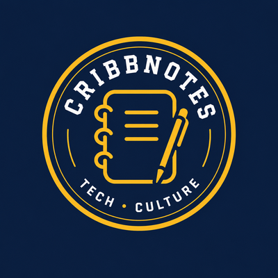

<p align="center"></p>

# Cribb Notes

**Feels like magic, but it's math.**

Short, plain-language notes on AI, the enterprise, and the human side of technology,
by [Mark Cribb](https://www.linkedin.com/in/mark-cribb). Cliff's Notes, by Cribb.

This repo is the source for the Cribb Notes website (built with [Quarto](https://quarto.org))
and the home of the hands-on Colab demo notebooks.

---

## What's here

| Path | What it is |
|------|------------|
| `index.qmd` | Home page: listing of the latest Notes across both streams |
| `tech.qmd` / `culture.qmd` | The two content streams (Tech · Culture, per the logo) |
| `notes/tech/`, `notes/culture/` | The Notes themselves (one folder per issue, filed by stream) |
| `labs/` | The runnable Colab notebooks (evergreen, reusable) |
| `speaking/` | Talks: booking pitch + a per-event archive linking its Labs/Notes |
| `about.qmd` | About the publication and the author |
| `_quarto.yml` | Site configuration |
| `styles.css` | Brand styling |
| `_templates/` | The Note template |
| `New-CribbNote.ps1` | Scaffolds a new Note from the template |
| `.github/workflows/publish.yml` | Auto-renders + deploys to GitHub Pages on push to `main` |
| `*.ipynb` | The Colab demo notebooks |

## Writing a new Note

```powershell
./New-CribbNote.ps1 -Title "What a Token Actually Is" -Categories AI,Demystified
quarto preview                 # live local preview at http://localhost:port
# edit notes/<slug>/index.qmd, then delete the `draft: true` line when ready
git add . ; git commit -m "Note: what a token actually is" ; git push
```

Pushing to `main` triggers the GitHub Action, which renders the site and publishes it.

## Local preview

```powershell
quarto preview        # hot-reloading local server
quarto render         # one-off build into ./_site
```

## Going live (one-time setup)

1. **Push this repo to `main`.**
2. In **GitHub → Settings → Pages**, set the source to the **`gh-pages` branch**
   (the workflow creates it on first run).
3. The site goes live at `https://mierkoles.github.io/CribbNotes/`.
4. **Custom domain:** the site serves at `https://cribbnotes.ai`. The `CNAME` file at
   the repo root holds the domain (copied into the build via `resources:` in
   `_quarto.yml`), the domain's DNS points at GitHub Pages (four apex `A` records to
   `185.199.108–111.153`, plus `www` CNAME to `mierkoles.github.io`), and the domain is
   set under Settings → Pages with **Enforce HTTPS** enabled.

## License

MIT for the demo code. The notebooks pull text from Project Gutenberg (public domain).

---

*Feels like magic, but it's math.*
