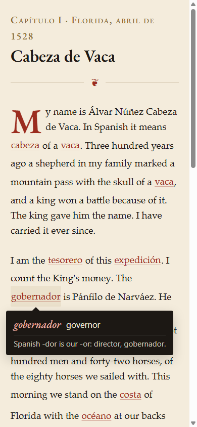

::: {.callout-note appearance="simple" icon=false}
**Mariposa** is a daily Spanish reader that starts in English and turns into Spanish, one chapter a day. [Try it](https://mierkoles.github.io/mariposa/), or [fork it and make it yours](https://github.com/Mierkoles/mariposa) for any book or language. MIT for the code, CC BY for the chapters.
:::

I have been learning Spanish on Duolingo for almost four years. The streak is alive at 1,456 days as I write this. The app's Score puts me at 39 on its scale of 130, which it translates as "you can order food at a restaurant." On the Common European Framework, the six-band scale most language exams use, that is A2, the second band, and it matches how it feels. I still enjoy it, and I am not stopping.

The app does what it promises. Five minutes a day, a mix of exercises, and a streak counter that has gotten me to open it 1,456 mornings in a row. The research says the time counts. A study the company commissioned in 2012 found that about 34 hours in the app covered the material of a first college semester of Spanish, as measured by a university placement exam.[^vg] A larger 2021 study by Duolingo's own researchers put learners who finished the beginning courses at Intermediate Low in reading, comparable to university students after four semesters.[^jiang]

What I wanted, four years in, was something outside what the daily exercises are for: a page I could read. A sentence with no story around it does not stay with me the way a page does. The thing that has held my attention in Spanish lately is a book. I am partway through *El arquero*, Paulo Coelho's short parable about an archer, in Spanish, and I keep opening it because I want to know what happens. Graded readers work like that. What they do not come with is the daily loop and the drill.

I wanted both, in one place, and the streak keeps going alongside it. The story has to be good enough to open tomorrow, and the mechanics have to make the words stick. What follows is my experience and what has worked for me. I am one learner sharing it.

## The one idea

In 1968 an anthropologist at the University of Michigan named Robbins Burling published a paper with the title "Some Outlandish Proposals for the Teaching of Foreign Languages."[^burling] One of the proposals was this: write the story in the learner's own language, and swap in words from the target language a few at a time. The reader keeps the thread, because the sentence is mostly English. The foreign words arrive inside a context the reader already understands. Chapter by chapter the ratio shifts, until the reader is reading the other language and did not notice the crossing.

Burling called it a diglot weave. He built a French reading course on it. It did not become a standard method, and I have not found a good account of why.

[Mariposa](https://mierkoles.github.io/mariposa/) is my version. The name is the Spanish word for butterfly, and I picked it because it is my favorite Spanish word to say out loud, and because I like butterflies. It also happens to describe the mechanism. The English is the caterpillar. The Spanish is what it turns into.

{fig-alt="A phone screen showing a chapter of Mariposa. English prose with Spanish words set in red. One word, gobernador, has been tapped, and a small dark card beneath it reads: gobernador, governor. Spanish -dor is our -or: director, gobernador." width=320 fig-align="center"}

## Why weaving works

Here is where it stops being a nice idea and starts being arithmetic.

Paul Nation, who has spent a career measuring vocabulary, worked out how many words a reader needs to know to read unassisted. His 2006 estimate is that you need to recognize about 98 percent of the running words on a page, and that reaching 98 percent coverage of ordinary written English takes a vocabulary of eight to nine thousand word families.[^nation] Below that line, reading turns into decoding, and decoding is not reading.

A beginner in Spanish knows a few hundred words. There is no Spanish text on earth where a few hundred words give 98 percent coverage. That is the trap every beginner's reader falls into: either the text is so simplified it has no plot, or it has a plot and the beginner cannot read it.

The weave manufactures the 98 percent. The English supplies the coverage. The Spanish is the 2 percent, placed exactly where the reader can infer it from everything around it. Chapter one of Mariposa is 335 words of English with eleven Spanish words woven in, eight of them cognates like *expedición* and *gobernador*. The reader stays above the line, and the line moves a little each chapter.

The rest of the mechanics come from the memory research, and none of it is exotic.

**Words learned from context are real, and they need repetition.** Nagy, Herman, and Anderson showed in 1985 that eighth graders picked up measurable knowledge of unfamiliar words from a single reading of a thousand-word passage. Small gains, reliably.[^nagy] Horst, Cobb, and Meara found the same in adult second-language readers who worked through a whole simplified novel.[^horst] Stuart Webb's 2007 study is the one I built a rule on: he varied how many times learners met a new word in context, and found sizeable gains by ten encounters, with something learned at every step from one to ten.[^webb] Every new word in a Mariposa chapter appears at least twice, and words from the previous three chapters have to come back.

**A test does more than a reread.** Roediger and Karpicke's 2006 experiments had students study a passage and then either reread it or take a recall test. Five minutes later the rereaders did better. A week later the tested group remembered substantially more.[^roediger] Each chapter ends with five or six short drills built only from that chapter. That is retrieval practice wearing a story.

**Gaps help.** Cepeda and colleagues reviewed 839 assessments of spaced practice across 317 experiments and found that the best gap between encounters grows with how long you want to remember something.[^cepeda] In Mariposa the spacing is the plot. A word you keep missing gets written into an upcoming chapter. The schedule is invisible because it looks like a story.

**The weave itself has been tested against drill.** A 2007 study at Brigham Young University compared a computer-based diglot reader with a sophisticated drill-and-practice program for second-language vocabulary. The reader produced the same vocabulary gains, the learners picked the words up incidentally from the story, and the authors report it lowered the affective barrier to the language.[^christensen] A 2014 study of sixty Iranian high school students found a statistically significant advantage for the weave over teaching words through definitions and synonyms.[^nemati] Small studies, and I would like to see bigger ones. They point the same direction.

## What I built, and what I threw away

I built the app on a Sunday evening in September with an AI coding assistant. It is a progressive web app, which means it installs to a phone home screen and works offline. About 14 kilobytes of code with no framework and no backend. Progress lives in the browser, with no account behind it. Each chapter is a JSON file: the prose, the woven words with their English, a note that appears the first time you tap a word, and the drills.

The first story was a night-desk mystery set in a Milwaukee hotel. I chose it because hotel vocabulary is dense with cognates. Then I asked the assistant how well it knew my reading, and it went through my own shelf and told me the truth: historical fiction, frontier survival, the Stoics, Tolkien, and nothing resembling a hotel procedural. The hotel lasted one chapter.

The story is now *Naufragios*. In 1528 three hundred Spaniards landed on the coast of Florida looking for gold. Eight years later four men walked into Sinaloa, naked, and the Spanish slavers who found them could not make sense of them. One of the four, Álvar Núñez Cabeza de Vaca, wrote it down. His *Relación*, published in 1542, is in the public domain, and it is the kind of thing I would read anyway. Ninety chapters planned, one a day. Levels one through five are prose written for the weave, with the Spanish rising through it. Level six is the 1542 text itself, lightly modernized. The reader finishes by reading a 16th-century chronicle in the original, without ever having been thrown into the deep end.

Chapter one is on the beach. Cabeza de Vaca's name means "head of a cow," which is the first two Spanish words the reader learns, and *vaca* comes back in chapter 57 when he sees his first bison and has no word for it but cow.

One chapter is written. Eighty-nine are not. My test for the whole thing is whether I open it twenty days in a row.

## The part that is not solved

The Spanish has to be correct. One wrong gender in a note costs more trust than ten features earn. The chapters are drafted by a model against a beat outline and reviewed by me, and I am the beginner here. That is the weak joint. The repo says so in plain words, and I am hoping a reader who knows Spanish better than I do sends a correction. [The repo](https://github.com/Mierkoles/mariposa) is public under MIT, the chapters are CC BY, and the method is documented well enough to fork for another book or another language. If you do, the one instruction I would give is the one I gave myself: pick a story you would read anyway. The mechanism does nothing for a plot you do not care about.

The whole thing is a 1968 idea and a 1542 shipwreck, held together by memory research anyone can look up. It feels like magic. It's math.

Mark

## References

[^vg]: Vesselinov, R., and Grego, J. (2012). *Duolingo Effectiveness Study*. Commissioned by Duolingo. Mean gain on the WebCAPE placement exam implied about 34 hours of study to cover a first college semester, with a 95 percent confidence interval of 26 to 49 hours. [Report PDF](https://theowlapp.health/wp-content/uploads/2022/04/DuolingoReport_Final-1.pdf).

[^jiang]: Jiang, X., Rollinson, J., Plonsky, L., Gustafson, E., and Pajak, B. (2021). Evaluating the reading and listening outcomes of beginning-level Duolingo courses. *Foreign Language Annals*, 54(4), 974–1002. Authors are Duolingo researchers. [Wiley](https://onlinelibrary.wiley.com/doi/abs/10.1111/flan.12600).

[^burling]: Burling, R. (1968). Some outlandish proposals for the teaching of foreign languages. *Language Learning*, 18(1–2). [Wiley](https://onlinelibrary.wiley.com/doi/abs/10.1111/j.1467-1770.1987.tb00390.x) · [University of Michigan Deep Blue](https://deepblue.lib.umich.edu/handle/2027.42/98107).

[^nation]: Nation, I. S. P. (2006). How large a vocabulary is needed for reading and listening? *Canadian Modern Language Review*, 63(1), 59–82. [PDF](https://www.lextutor.ca/cover/papers/nation_2006.pdf).

[^nagy]: Nagy, W. E., Herman, P. A., and Anderson, R. C. (1985). Learning words from context. *Reading Research Quarterly*, 20(2), 233–253. [Semantic Scholar](https://www.semanticscholar.org/paper/Learning-Words-from-Context.-Nagy-Herman/2aecdf006c2e00606e8f139a4b80d8678d3f26dc).

[^horst]: Horst, M., Cobb, T., and Meara, P. (1998). Beyond A Clockwork Orange: Acquiring second language vocabulary through reading. *Reading in a Foreign Language*, 11(2), 207–223. [ERIC](https://eric.ed.gov/?id=EJ577617).

[^webb]: Webb, S. (2007). The effects of repetition on vocabulary knowledge. *Applied Linguistics*, 28(1), 46–65. [Oxford Academic](https://academic.oup.com/applij/article-abstract/28/1/46/174744).

[^roediger]: Roediger, H. L., and Karpicke, J. D. (2006). Test-enhanced learning: Taking memory tests improves long-term retention. *Psychological Science*, 17(3), 249–255. [SAGE](https://journals.sagepub.com/doi/10.1111/j.1467-9280.2006.01693.x).

[^cepeda]: Cepeda, N. J., Pashler, H., Vul, E., Wixted, J. T., and Rohrer, D. (2006). Distributed practice in verbal recall tasks: A review and quantitative synthesis. *Psychological Bulletin*, 132(3), 354–380. [PDF](https://augmentingcognition.com/assets/Cepeda2006.pdf).

[^christensen]: Christensen, E., Merrill, P., and Yanchar, S. (2007). Second language vocabulary acquisition using a diglot reader or a computer-based drill and practice program. *Computer Assisted Language Learning*, 20(1), 67–77. [Taylor & Francis](https://www.tandfonline.com/doi/full/10.1080/09588220601118511).

[^nemati]: Nemati, A., and Maleki, E. (2014). The effect of teaching vocabulary through the diglot-weave technique on vocabulary learning of Iranian high school students. *Procedia, Social and Behavioral Sciences*, 98, 1340–1345. [ScienceDirect](https://www.sciencedirect.com/science/article/pii/S1877042814026421).
